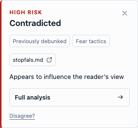

# CLAR

**Check a Facebook post. See the evidence. Make up your own mind.**

CLAR helps you check factual claims, recognize opinions, and notice persuasive language. Use it directly in your Facebook feed or paste a post into the web app.

Built first for Moldova, with **Romanian, Russian, and English** support. Run the AI on your own hardware or connect a Google model.

[Get started](#get-started) · [Use it in Facebook](#use-it-in-facebook) · [Compare models](#compare-models) · [Latest release](https://github.com/Alcray/clar/releases/latest)



*Interface preview using synthetic test data.*

## What you can do

- **Check a claim:** see whether the available evidence supports it, contradicts it, or leaves it unresolved.
- **Open the sources:** follow citations and related fact-checks to read the context yourself.
- **Notice persuasion:** inspect quoted phrases and explanations of how they may influence a reader.
- **Stay in your feed:** get a compact result first, then open the full analysis when you want more detail.
- **Use your preferred model:** connect Ollama, an OpenAI-compatible model server, Gemini API, or Vertex AI.

CLAR can also read text from screenshots. It does not authenticate photographs or analyze video.

## Get started

You’ll need Git and Docker with Compose v2.24 or newer. [Docker Desktop](https://www.docker.com/products/docker-desktop/) includes Compose. Choose **one** AI setup below; Google models do not require a local GPU.

### 1. Download CLAR

```sh
git clone https://github.com/Alcray/clar.git
cd clar
cp .env.example .env
```

The `.env` file holds your settings. Open it in a text editor for the next step.

### 2. Choose where the AI runs

<details open>
<summary><strong>On your computer with Ollama</strong></summary>

Install and start [Ollama](https://ollama.com/download), then download a model. This small vision model is a starting example:

```sh
ollama pull qwen2.5vl:3b
```

Keep these settings in `.env`:

```dotenv
DEFAULT_PROVIDER=local
LOCAL_PROVIDER=ollama
LOCAL_MODEL=qwen2.5vl:3b
OLLAMA_BASE_URL=http://host.docker.internal:11434
```

Keep Ollama running while you use CLAR. You can choose another installed model by changing `LOCAL_MODEL`; screenshots require a model that can read images.

The address above is for Docker Desktop. **On Linux**, follow the [Ollama networking instructions](docs/SELF-HOSTING.md#docker-compose) or the [NVIDIA container setup](docs/SELF-HOSTING.md#optional-nvidia-ollama-container).

Local checks use a limited collection of public sources. They may leave recent or unrelated claims unresolved.

</details>

<details>
<summary><strong>With a Google API key</strong></summary>

For the Gemini API, change these settings in `.env`:

```dotenv
DEFAULT_PROVIDER=gemini
GEMINI_API_KEY=your_gemini_api_key
```

For Vertex AI Express, use these instead:

```dotenv
DEFAULT_PROVIDER=vertex
VERTEX_API_KEY=your_vertex_api_key
```

Google modes use Google Search to look for evidence. Selected content is sent to Google, and API usage is billed to your Google account. Your key stays on the CLAR server.

</details>

Already running vLLM, llama.cpp, or another model server? Use the [OpenAI-compatible setup](docs/SELF-HOSTING.md#an-existing-openai-compatible-model-server).

### 3. Start CLAR

Run these commands in order:

```sh
docker compose build
docker compose run --rm clar python manage_invites.py create owner
docker compose up -d clar
```

**Save the access code printed by the second command.** It signs you into the website. You only need to create this owner invitation once.

Open **[http://localhost:8765](http://localhost:8765)** and enter your code. Try the prepared example, paste a post, or upload a screenshot.

Prefer running Python directly, or want to host CLAR for other people? See the [self-hosting guide](docs/SELF-HOSTING.md) for native installation, HTTPS, GPU setup, and updates.

## Use it in Facebook

The extension needs a running CLAR server. You can try the web app before installing it.

1. In the CLAR website, click **Get CLAR for Chrome**. Download the ZIP and extract it into a folder you’ll keep.
2. In desktop Chrome 141 or later, open `chrome://extensions`, enable **Developer mode**, and choose **Load unpacked**. Select the folder containing `manifest.json`.
3. Copy the **pairing code** from the website’s extension guide. Open the extension’s **Settings**, select your server, paste the code, and save.
4. Refresh Facebook. Click **Analyze** below a post, then click its result to open the compact card. Choose **Full analysis** for the evidence and detailed explanation.

The website access code and extension pairing code are different: the website’s guide gives you the pairing code after you sign in.

Automatic feed scanning is optional and starts off. Reopening a completed check uses the saved result; you can clear saved checks in Settings.

For a server on another computer or an extension update, follow the [extension guide](extension/README.md). The release ZIP targets localhost; a remote server needs a package built for its address.

## Compare models

CLAR includes a benchmark so you can compare **quality, speed, and failures** before choosing a model.

- **Fixed evidence:** every model gets the same post and source excerpts.
- **Live checks:** models run through CLAR’s actual research and assessment process.
- **Screenshots:** measure text recognition as well as the assessment.

Start with the [benchmark guide](benchmarks/README.md) for commands and model configuration. You can also browse the [published measurements](docs/benchmarks/2026-09-26/README.md), including unsuccessful responses.

To check that the dataset is ready without making model calls:

```sh
docker compose run --rm clar python -m benchmarks validate
```

The starter cases have editorial labels and are intended for development. Their scores are not independent proof of real-world accuracy.

## If something isn’t working

| What you see | What to check |
| --- | --- |
| CLAR cannot reach the local model | Make sure Ollama is running, the model has been downloaded, and `OLLAMA_BASE_URL` is reachable from Docker. See [network setup](docs/SELF-HOSTING.md#docker-compose). |
| The website asks for an access code | Use the code printed when you created the owner invitation. The extension pairing code is a separate credential. |
| The extension has no Analyze button | Refresh Facebook after installation. You can also select text from one post and use the CLAR right-click menu. |
| You changed the server address | Rebuild and reload the extension for the new address. See [building for your server](extension/README.md#build-for-your-server). |

For a reproducible bug, [open an issue](https://github.com/Alcray/clar/issues) with a public or synthetic example. Leave out API keys, access codes, and private Facebook content.

## Privacy and limitations

CLAR can be wrong. Read its sources before relying on a result. An official source can make an unsupported claim, and persuasive language alone does not prove deception.

The extension sends selected content to your configured server. Google modes use Google’s services; local mode uses the model server you choose and may still fetch public evidence pages. See [PRIVACY.md](PRIVACY.md) for caching and feedback details.

Self-hosting currently supports one application instance. The [deployment guide](docs/SELF-HOSTING.md#operation-and-limits) covers authentication, backups, and operating limits.

## Contribute

Bug reports, clearer explanations, translations, model integrations, and reviewed benchmark cases are welcome. Start with [CONTRIBUTING.md](CONTRIBUTING.md). For vulnerabilities, follow [SECURITY.md](SECURITY.md).

Licensed under [Apache-2.0](LICENSE). External model weights and publisher content keep their own licenses.
